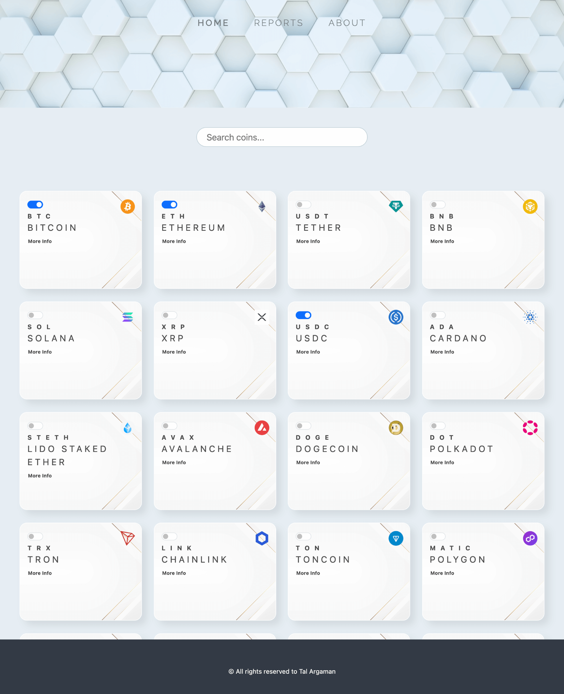

## CryptoLand

CryptoLand is a cryptocurrency tracking app that allows users to select the favorite coins and view their live stats, including price data in multiple currencies.

- **Select up to 5 cryptocurrencies to track their live price.**
- **View real-time price data for selected coins in USD, EUR & ILS.**

**Git Page:** 
 https://toulouse6.github.io/crypto-land/

---

**Technologies:**

- **TypeScript**
- **CSS3**
- **HTML5**
- **CoinGecko API**
- **Canva.js**
- **Bootstrap JS Modal**

---

**Author**: Tal Argaman
